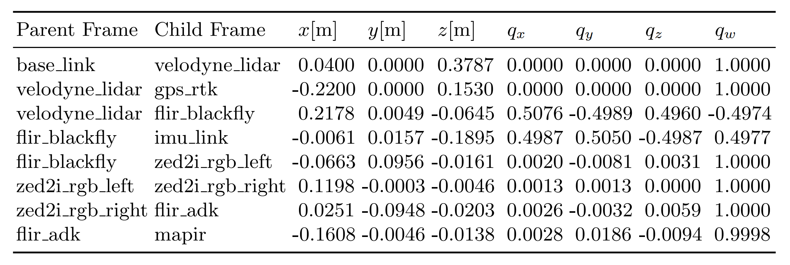
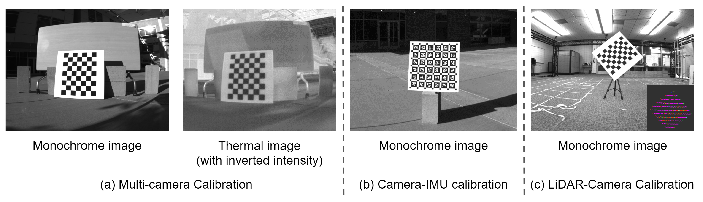

## Sensor Setup
We employ the Clearpath Jackal wheeled mobile robot to collect multi-sensor data in the agricultural fields.
The sensor setup on the robot is illustrated in the figure below (left).
The corresponding reference frames are highlighted in the figure below (right).
Red, green and blue bars denote x, y and z axes respectively. They are generated in RViz using real calibrated extrinsic parameters.

## Extrinsic Parameter Calibration

Most frame names are self-explanatory; you can find its correspondence to each sensor in the sensor-setup figure above.
It is worth noting that `base_link` is the frame used by wheel odometry, and is located at the center bottom of the robot base.

Other notes regarding GPS frame:
- With one GPS receiver on the robot, we can access only the 3D position (rather than full 6-DoF pose) of the robot. Therefore, the orientation (quaternion) component of LiDAR-GPS is not very meaningful.
- More precisely, the GPS-RTK data is with respect to the center of the GPS receiver; if your algorithm output is expressed in IMU or LiDAR frame, it is better to convert it to GPS frame first, before computing the error (e.g., Absolute Trajectory Error (ATE)). We provide such evaluation scripts in the [tools](tools.html) as well.

In summary, these extrinsic parameters are obtained by four steps:
- Multi-camera calibration for Monochrome, RGB, NIR (RGN), Thermal cameras using [Kalibr toolbox](https://github.com/ethz-asl/kalibr).
- Camera-IMU calibration for Monochrome camera and IMU using [Kalibr toolbox](https://github.com/ethz-asl/kalibr).
- LiDAR-camera calibration using [ACFR toolbox](https://github.com/acfr/cam_lidar_calibration).
- LiDAR-GPS and LiDAR-baselink are measured and computed directly from CAD models.

For details regarding how we performed these calibration steps, please refer to our paper or the README file in the calibration data folder.

## Intrinsic Parameter Calibration
TBD.
