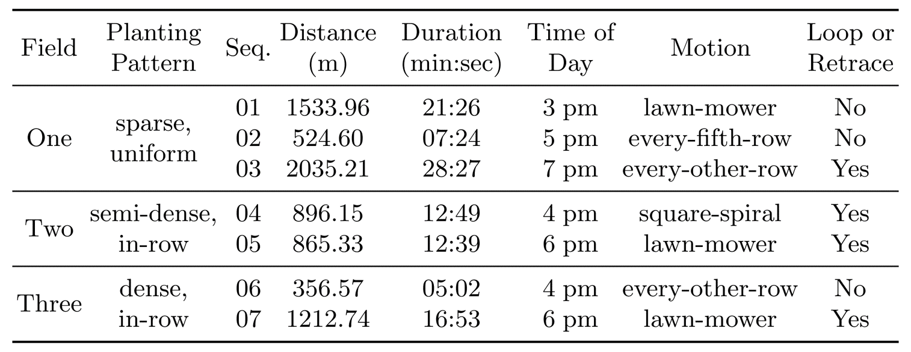

## Sequence Info

## Data Format and Download
The primary data format we used in data collection is [ROS bags](http://wiki.ros.org/rosbag). To simplify data storage and transfer, we split recorded data into blocks of 4GB, and categorized them based on their respective modalities.

You may download only those ROS bags that are of your interest. After download, simply place these ROS bags in the same folder and run `rosbag play *.bag`. ROS will automatically arrange the data across all bags and sequence the playback according to their timestamps.

Click [this link](https://drive.google.com/drive/folders/12h5CAagVVtz1Od9bK_O6hDMyG8Xh_DLG?usp=sharing) to download all sequences of data.

