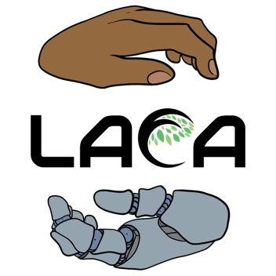
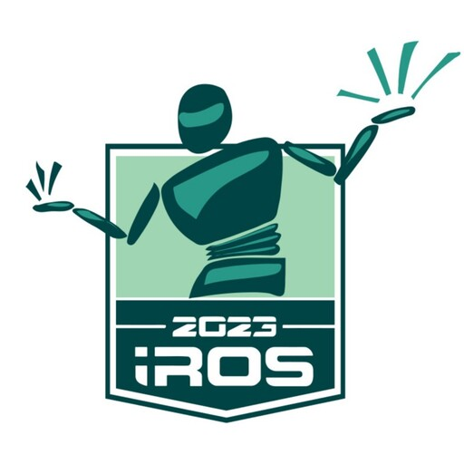
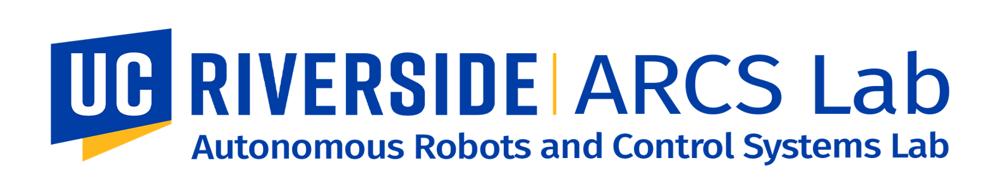

## CitrusFarm Dataset
CitrusFarm is a multimodal agricultural robotics dataset that provides both **multispectral images** and **navigational sensor data** for localization, mapping and crop monitoring tasks.
- It was collected by a wheeled mobile robot in the [Agricultural Experimental Station](https://cnas.ucr.edu/resources/agricultural-experiment-station) at the [University of California Riverside](https://www.ucr.edu/) in the summer of 2023.
- It offers a total of **nine** sensing modalities, including stereo RGB, depth, monochrome, near-infrared and thermal images, as well as wheel odometry, LiDAR, IMU and GPS-RTK data.
- It comprises seven sequences collected from three citrus tree fields, featuring various tree species at different growth stages, distinctive planting patterns, as well as varying daylight conditions.
- It spans a total operation time of 1.7 hours, covers a total distance of 7.5 km, and constitutes 1.3 TB of data.

**Authors:** Hanzhe Teng, Yipeng Wang, Xiaoao Song and Konstantinos Karydis from [ARCS Lab](https://sites.google.com/view/arcs-lab/) at [UC Riverside](https://www.ucr.edu/).

**Related Workshop Spotlight:** [Present and Future of Agricultural Robotics and Technologies: Academic and Industry Perspectives](https://sites.google.com/view/agrobotics) (IROS 2023)

**Related Publications:**
H. Teng, Y. Wang, X. Song and K. Karydis, "Multimodal Dataset for Localization, Mapping and Crop Monitoring in Citrus Tree Farms", in the 18th International Symposium on Visual Computing (ISVC 2023). [[paper](https://link.springer.com/chapter/10.1007/978-3-031-47969-4_44)] [[preprint](https://arxiv.org/abs/2309.15332)]
```
@inproceedings{teng2023multimodal,
  title={Multimodal Dataset for Localization, Mapping and Crop Monitoring in Citrus Tree Farms},
  author={Teng, Hanzhe and Wang, Yipeng and Song, Xiaoao and Karydis, Konstantinos},
  booktitle={International Symposium on Visual Computing},
  pages={571--582},
  year={2023}
}
```

## License
CitrusFarm dataset is released under the [Creative Commons Attribution-ShareAlike 4.0 International (CC BY-SA 4.0)](https://creativecommons.org/licenses/by-sa/4.0). You are allowed to **share** and **adapt** under the condition that you **give appropriate credit**, **indicate if changes were made**, and distribute your contributions under the **same license**.

## Acknowledgement
This work is supported in part by NSF, USDA-NIFA, ONR and the University of California UC-MRPI.
Furthermore, we thank Dr. Peggy Mauk and the staff team at UCR's Agricultural Experimental Station for their support in our work.






